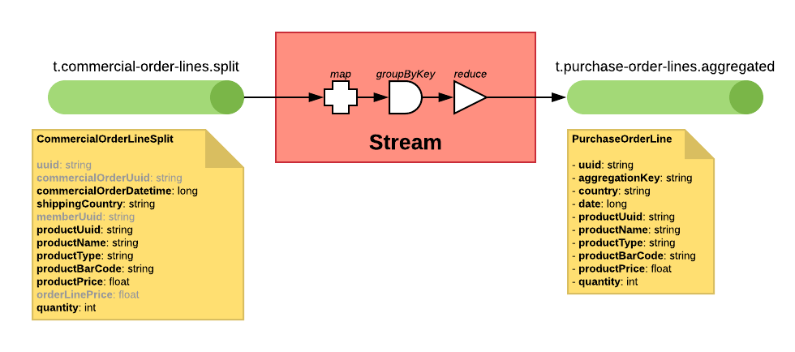

# Kafka Streams Proof of Concept

Proof of Concept showing different use cases with Apache Kafka and Kafka Streams.

**GitHub**: https://github.com/davamigo/kafka-streams-poc

## Architecture

This PoC consist in a Producer to generate random data and send it to Kafka topics; and some Kafka Stream processes to convert the generated data into something else.

Also there are some consumers who write in a mongoDB database and a small front end to show the contents of the collections in mongoDB.

The whole project is designed to have a separate microservice for each process, but it is programmed as a monolith because this is just a PoC.

## Producers

### Generate Commercial Order

Produces a commercial order with random data.

- Random member: creates a new member or uses an existing one.
- Random order lines number (1 to 10).
    - Random products: creates a new product or uses an existing one.
    - Random price for the new products (1 to 100).
    - Random quantity for the order line (1 to 5).
- Publish the new commercial order in a `t.commercial-orders.new` topic.
- Publish new members in `t.members.new` topic.
- Publish new products in `t.products.new` topic.

## Kafka Streams

### Convert the commercial orders

Joins each **commercial order** with the **member** data.
Also computes some fields like the total amount of the order.
The target stream won't have the billing address nor the order lines.
The aggregationKey in the new stream will be the same (the `uuid` of the commercial order).

- From `t.commercial-orders.new` (KStream).
- Join with `t.members.new` (GlobalKTable).
- To `t.commercial-orders.converted` (KStream).

### Split the commercial order lines

Extracts all the **order lines** from the **commercial orders** and joins each commercial order line with the **product** data.
Each order line will generate one or more message in the target stream.
The aggregationKey of the new stream will be the same (the `uuid` of the commercial order) to allow grouping.

- From `t.commercial-orders.new` (KStream).
- Join with `t.products.new` (GlobalKTable).
- To `t.commercial-order-lines.split` (KStream).

### Aggregate the purchase order lines

Reduces the **commercial order lines** by adding the quantities for the same country, product and day to generate the **purchase order lines**.
One purchase order line will be generated per per country, product and day.
The aggregationKey of the new stream will be the concatenation of `contry-code`, `date(yyyy-mm-dd)` and `product-uuid`.

- From `t.commercial-order-lines.split`.
- To `t.purchase-order-lines.aggregated`.

### Generate the purchase orders

Generates one **purchase order** per country and day by aggregating the **purchase order lines**.
The purchase order will havea list of all order lines.
The aggregationKey of the new stream will be the concatenation of `contry-code` and `date(yyyy-mm-dd)`.

- From `t.purchase-order-lines.aggregated`.
- To `t.purchase-orders.generated`.

### Send orders to warehouse

_**TBD**_

- From `t.commercial-orders.converted`
- Join `t.commercial-order-lines.split`
- To `t.warehouse-order.new`

### Generate the bill

_**TBD**_

- From `t.commercial-orders.new`
- Join `t.members.new`
- To `t.bill.new`

## Topics

- `t.commercial-orders.new`: All the commercial orders. No aggregationKey.
- `t.members.new`: All data of the member. The aggregationKey is the member uuid.
- `t.products.new`: All data of the product. The aggregationKey is the product uuid.
- `t.commercial-orders.converted`: Commercial orders with member data, but without order line. The aggregationKey is the commercial order uuid.
- `t.commercial-order-lines.split`: Commercial order lines. The aggregationKey is the commercial order uuid.
- `t.purchase-order.new`: Purchase order data. The aggregationKey is the date (int, format YYYMMDD).
- `t.warehouse-order.new`: The warehouse order data. The aggregationKey is the commercial order uuid.
- `t.bill.new`: The bill data. The aggregationKey is the member uuid.

## Schemas

### Member

#### Member

- **`uuid`**: `string`
- **`firstName`**: `string`
- **`lastName`**: `string`
- **`addresses`**: `Array[MemberAddress]`

#### MemberAddress

- **`country`**: `string`
- **`state`**: `string`, nullable, default `null`
- **`city`**: `string`
- **`zipCode`**: `string`
- **`street`**: `string`, nullable, default `null`
- **`number`**: `string`, nullable, default `null`
- **`extra`**: `string`, nullable, default `null`

### Product

#### Product

- **`uuid`**: `string`
- **`name`**: `string`
- **`price`**: `float`

### CommercialOrder

#### CommercialOrder

- **`uuid`**: `string`
- **`datetime`**: `long`
- **`memberUuid`**: `string`
- **`shippingAddress`**: `CommercialOrderAddress`
- **`billingAddress`**: `CommercialOrderAddress`, nullable, default `null`
- **`lines`**: `array[CommercialOrderLine]`

#### CommercialOrderLine

- **`uuid`**: `string`
- **`commercialOrderUuid`**: `string`
- **`productUuid`**: `string`
- **`price`**: `float`
- **`quantity`**: `int`, default `1`

#### CommercialOrderAddress

- **`country`**: `string`
- **`state`**: `string`, nullable, default `null`
- **`city`**: `string`
- **`zipCode`**: `string`
- **`street`**: `string`, nullable, default `null`
- **`number`**: `string`, nullable, default `null`
- **`extra`**: `string`, nullable, default `null`

#### CommercialOrderConverted

- **`uuid`**: `string`
- **`datetime`**: `long`
- **`memberUuid`**: `string`
- **`memberFirstName`**: `string`
- **`memberLastName`**: `string`
- **`shippingCountry`**: `string`
- **`shippingCity`**: `string`
- **`shippingZipCode`**: `string`
- **`totalAmount`**: `float`
- **`totalQuantity`**: `int`

#### CommercialOrderLineSplit

- **`uuid`**: `string`
- **`commercialOrderUuid`**: `string`
- **`commercialOrderDatetime`**: `long`
- **`shippingCountry`**: `string`
- **`memberUuid`**: `string`
- **`productUuid`**: `string`
- **`productName`**: `string`
- **`productPrice`**: `float`
- **`orderLinePrice`**: `float`
- **`quantity`**: `int`

## Links

- [Kafka Streams DSL developer guide](https://kafka.apache.org/20/documentation/streams/developer-guide/dsl-api.html)
