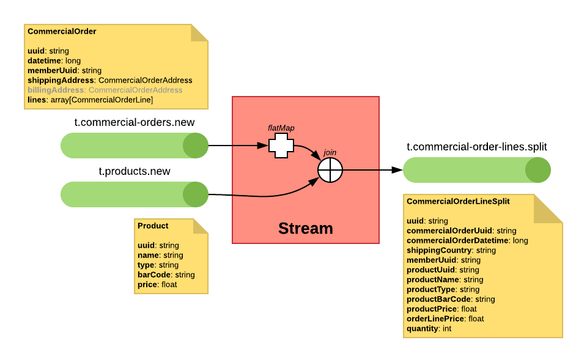

# Kafka Streams Proof of Concept

## Producers

### Generate Commercial Order

Produces a commercial order with random data.

- Random member: creates a new member or uses an existing one.
- Random order lines number (1 to 10).
    - Random products: creates a new product or uses an existing one.
    - Random price for the new products (1 to 100).
    - Random quantity for the order line (1 to 5).
- Publish the new commercial order in a `t.commercial-orders.new` topic.
- Publish new members in `t.members.new` topic.
- Publish new products in `t.products.new` topic.

## Kafka Streams

### Convert the commercial orders

Join each commercial order with the member data, compute some fields like the total amount. The target contracts doen't have the order lines.

- From `t.commercial-orders.new` (KStream).
- Join with `t.members.new` (GlobalKTable).
- To `t.commercial-orders.converted` (KStream).

### Split the commercial order lines

Extract all order lines from the commercial orders and join each commercial order line with the product data.

- From `t.commercial-orders.new` (KStream).
- Join with `t.products.new` (GlobalKTable).
- To `t.commercial-order-lines.split` (KStream).

### Generate purchase orders

Group the commercial orders per product and day to generate the purchase orders. 

- From `t.commercial-order-lines.split`.
- To `t.purchase-order.new`.

### Send orders to warehouse

_**TBD**_

- From `t.commercial-orders.converted`
- Join `t.commercial-order-lines.split`
- To `t.warehouse-order.new`

### Generate the bill

_**TBD**_

- From `t.commercial-orders.new`
- Join `t.members.new`
- To `t.bill.new`

## Topics

- `t.commercial-orders.new`: All the commercial orders. No key.
- `t.members.new`: All data of the member. The key is the member uuid.
- `t.products.new`: All data of the product. The key is the product uuid.
- `t.commercial-orders.converted`: Commercial orders with member data, but without order line. The key is the commercial order uuid.
- `t.commercial-order-lines.split`: Commercial order lines. The key is the commercial order uuid.
- `t.purchase-order.new`: Purchase order data. The key is the date (int, format YYYMMDD).
- `t.warehouse-order.new`: The warehouse order data. The key is the commercial order uuid.
- `t.bill.new`: The bill data. The key is the member uuid.

## Schemas

### Member

#### Member

- **`uuid`**: `string`
- **`firstName`**: `string`
- **`lastName`**: `string`
- **`addresses`**: `Array[MemberAddress]`

#### MemberAddress

- **`country`**: `string`
- **`state`**: `string`, nullable, default `null`
- **`city`**: `string`
- **`zipCode`**: `string`
- **`street`**: `string`, nullable, default `null`
- **`number`**: `string`, nullable, default `null`
- **`extra`**: `string`, nullable, default `null`

### Product

#### Product

- **`uuid`**: `string`
- **`name`**: `string`
- **`price`**: `float`

### CommercialOrder

#### CommercialOrder

- **`uuid`**: `string`
- **`datetime`**: `long`
- **`memberUuid`**: `string`
- **`shippingAddress`**: `CommercialOrderAddress`
- **`billingAddress`**: `CommercialOrderAddress`, nullable, default `null`
- **`lines`**: `array[CommercialOrderLine]`

#### CommercialOrderLine

- **`uuid`**: `string`
- **`commercialOrderUuid`**: `string`
- **`productUuid`**: `string`
- **`price`**: `float`
- **`quantity`**: `int`, default `1`

#### CommercialOrderAddress

- **`country`**: `string`
- **`state`**: `string`, nullable, default `null`
- **`city`**: `string`
- **`zipCode`**: `string`
- **`street`**: `string`, nullable, default `null`
- **`number`**: `string`, nullable, default `null`
- **`extra`**: `string`, nullable, default `null`

#### CommercialOrderConverted

- **`uuid`**: `string`
- **`datetime`**: `long`
- **`memberUuid`**: `string`
- **`memberFirstName`**: `string`
- **`memberLastName`**: `string`
- **`shippingCountry`**: `string`
- **`shippingCity`**: `string`
- **`shippingZipCode`**: `string`
- **`totalAmount`**: `float`
- **`totalQuantity`**: `int`

#### CommercialOrderLineSplit

- **`uuid`**: `string`
- **`commercialOrderUuid`**: `string`
- **`commercialOrderDatetime`**: `long`
- **`shippingCountry`**: `string`
- **`memberUuid`**: `string`
- **`productUuid`**: `string`
- **`productName`**: `string`
- **`productPrice`**: `float`
- **`orderLinePrice`**: `float`
- **`quantity`**: `int`
