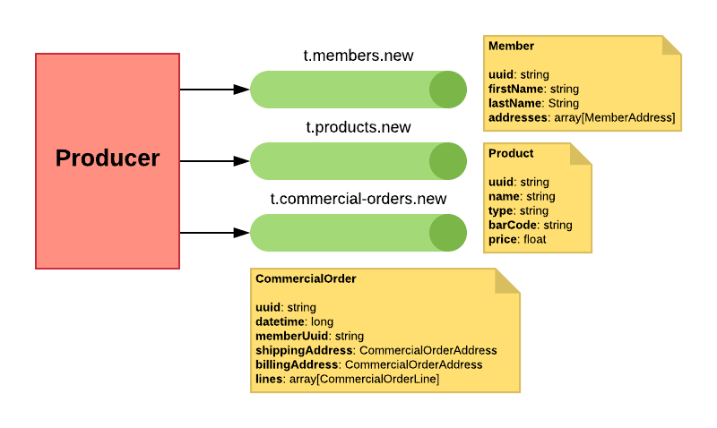
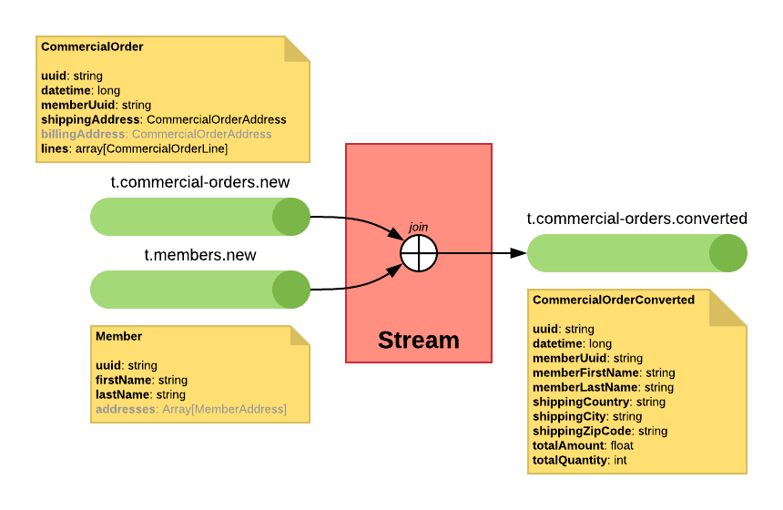

# Kafka Streams Proof of Concept

## Producers

### Generate Commercial Order

Produces a commercial order with random data.

- Random member: creates a new member or uses an existing one.
- Random order lines number (1 to 10).
    - Random products: creates a new product or uses an existing one.
    - Random price for the new products (1 to 100).
    - Random quantity for the order line (1 to 5).
- Publish the new commercial order in a `commercial-order` topic.
- Publish new members in `member` topic.
- Publish new products in `product` topic.

## Kafka Streams

### Convert the commercial orders

Join each commercial order with the member data, compute some fields like the total amount. The target contracts doen't have the order lines.

- From `commercial-order` (KStream).
- Join with `member` (GlobalKTable).
- To `commercial-order-converted` (KStream).

### Split the commercial order lines

Join the commercial order line and product data and stream the commercial order lines to a separated topic.

- From `commercial-order`.
- Join with `product`.
- To `commercial-order-line`.

### Generate purchase orders

Group the commercial orders per product and day to generate the purchase orders. 

- From `commercial-order-line`.
- To `purchase-order`.

### Send orders to warehouse

_**TBD**_

- From `commercial-order-converted`
- Join `commercial-order-line`
- To `warehouse-order`

### Generate the bill

_**TBD**_

- From `commercial-order`
- Join `member`
- To `bill`

## Topics

- `commercial-order`: All the commercial orders. No key.
- `member`: All data of the member. The key is the member uuid.
- `product`: All data of the product. The key is the product uuid.
- `commercial-order-converted`: Commercial orders with member data, but without order line. The key is the commercial order uuid.
- `commercial-order-line`: Commercial order lines. The key is the commercial order uuid.
- `purchase-order`: Purchase order data. The key is the date (int, format YYYMMDD).
- `warehouse-order`: The warehouse order data. The key is the commercial order uuid.
- `bill`: The bill data. The key is the member uuid.

## Schemas

### CommercialOrder

#### Member

- **`uuid`**: `string`
- **`firstName`**: `string`
- **`lastName`**: `string`
- **`addresses`**: `Array[MemberAddress]`

#### MemberAddress

- **`country`**: `string`
- **`state`**: `string`, nullable, default `null`
- **`city`**: `string`
- **`zipCode`**: `string`
- **`street`**: `string`, nullable, default `null`
- **`number`**: `string`, nullable, default `null`
- **`extra`**: `string`, nullable, default `null`

#### Product

- **`uuid`**: `string`
- **`name`**: `string`
- **`price`**: `float`

#### CommercialOrder

- **`uuid`**: `string`
- **`datetime`**: `long`
- **`memberUuid`**: `string`
- **`shippingAddress`**: `CommercialOrderAddress`
- **`billingAddress`**: `CommercialOrderAddress`, nullable, default `null`
- **`lines`**: `array[CommercialOrderLine]`

#### CommercialOrderLine

- **`uuid`**: `string`
- **`commercialOrderUuid`**: `string`
- **`productUuid`**: `string`
- **`price`**: `float`
- **`quantity`**: `int`, default `1`

#### CommercialOrderAddress

- **`country`**: `string`
- **`state`**: `string`, nullable, default `null`
- **`city`**: `string`
- **`zipCode`**: `string`
- **`street`**: `string`, nullable, default `null`
- **`number`**: `string`, nullable, default `null`
- **`extra`**: `string`, nullable, default `null`

#### CommercialOrderConverted

- **`uuid`**: `string`
- **`datetime`**: `long`
- **`memberUuid`**: `string`
- **`memberFirstName`**: `string`
- **`memberLastName`**: `string`
- **`shippingCountry`**: `string`
- **`shippingCity`**: `string`
- **`shippingZipCode`**: `string`
- **`totalAmount`**: `float`
- **`totalQuantity`**: `int`