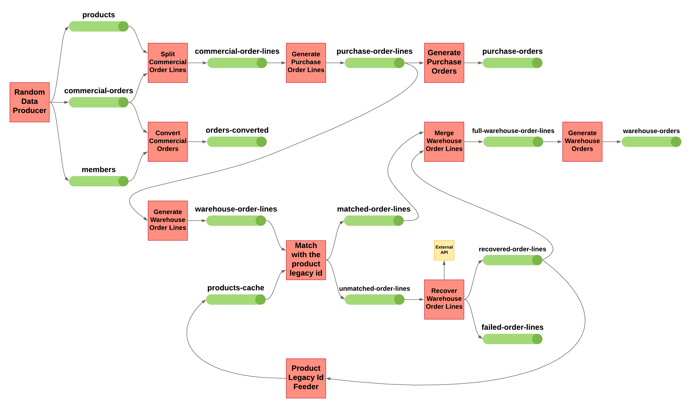
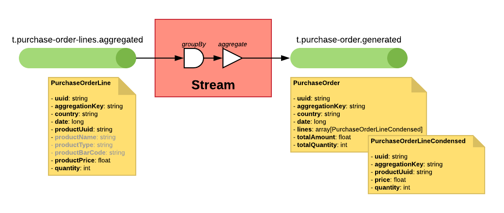

# Kafka Streams Proof of Concept

This ia Proof of Concept showing different use cases with **Apache Kafka** and **Kafka Streams**, with a real world examples.

The point is to show how to use Kafka Streams to transform data in real time.

**GitHub**: https://github.com/davamigo/kafka-streams-poc

---

## Statement (the problem to solve)

We have three entities: `commercial-orders`, `products` and `members`.

* Each `commercial-order` has the `member-uuid`, the `sell-date` and one or more `commercial-order-lines`.

* Each `commercial-order-line` contains the `product-uuid`, the `sell-price` and the `quantity`.

We want to get create `purchase-orders` per country and day.

* Each `purchase-order` will have the `country`, the `day` and a list or `purchase-order-lines`.

* Each `purchase-order-line` will have the `product-uuid`, the `product-name`, the `product-price` and the sum of the `quantities`.

Also we want to get create `warehouse-orders` per country and day.

* Each `warehouse-order` will have the `country` , the `day` and a list or `warehouse-order-lines`.

* Each `warehouse-order-line` will have the `product-legacy-id`, the `product-barcode` and the sum of the `quantities`.

* The `product-legacy-id` is not in the `product` entity, but can be recovered from a REST API.

---

## Architecture

This PoC consist in a Producer to generate random data and send it to Kafka topics; and some Kafka Stream processes to convert the generated data into something else.



The whole project is designed to have a separate microservice for each process, but it is programmed as a monolith because this is just a PoC.

---

## Producers

### Generate Commercial Order

Produces a commercial order with random data.


- Random member: creates a new member or uses an existing one.
- Random order lines number (1 to 10).
    - Random products: creates a new product or uses an existing one.
    - Random price for the new products (1 to 100).
    - Random quantity for the order line (1 to 5).
- Publish the new commercial order in a `t.commercial-orders.new` topic.
- Publish new members in `t.members.new` topic.
- Publish new products in `t.products.new` topic.

---

## Consumers

There are some consumers who write in a mongoDB database and a small front end to show the contents of the collections in mongoDB.


---

## Kafka Streams

### Convert the commercial orders

Joins each **commercial order** with the **member** data.
Also computes some fields like the total amount of the order.
The target stream won't have the billing address nor the order lines.
The key in the new stream will be the same (the `uuid` of the commercial order).


- From `t.commercial-orders.new` (KStream).
- Join with `t.members.new` (GlobalKTable).
- To `t.commercial-orders.converted` (KStream).

---

### Split the commercial order lines

Extracts all the **order lines** from the **commercial orders** and joins each commercial order line with the **product** data.
Each order line will generate one or more message in the target stream.
The key of the new stream will be the same (the `uuid` of the commercial order) to allow grouping.


- From `t.commercial-orders.new` (KStream).
- Join with `t.products.new` (GlobalKTable).
- To `t.commercial-order-lines.split` (KStream).

---

### Aggregate the purchase order lines

Reduces the **commercial order lines** by adding the quantities for the same country, product and day to generate the **purchase order lines**.
One purchase order line will be generated per per country, product and day.
The key of the new stream will be the concatenation of `contry-code`, `date(yyyy-mm-dd)` and `product-uuid`.


- From `t.commercial-order-lines.split`.
- To `t.purchase-order-lines.aggregated`.

---

### Generate the purchase orders

Generates one **purchase order** per country and day by aggregating the **purchase order lines**.
The purchase order will have a list of all order lines.
The key of the new stream will be the concatenation of `contry-code` and `date(yyyy-mm-dd)`.



- From `t.purchase-order-lines.aggregated`.
- To `t.purchase-orders.generated`.

---

### Generate warehouse order lines

Generates the **warehouse order lines** from the **purchase order lines**.
The key will be the `uuid` of the new warehouse order line.


- From `t.purchase-order-lines.aggregated`. 
- To `t.warehouse-order-lines.generated`.

---

### Match warehouse order line with the product legacy id

In this example we are assuming the WMS (_Warehouse Management System_) needs a ***legacy product id*** which is stored in another topic, but it's possible this `legacy_id` is not there.
So we are doing a `leftJoin` operation to not loose any product.

The output are two topics (_matched_ or _unmatched_), depending on the legacy product id was found or not.


- From `t.warehouse-order-lines.generated`.
- Left join with `t.product-legacy-ids.cache`. 
- To `t.warehouse-order-lines.matched`.
- To `t.warehouse-order-lines.unmatched`.

---

### Recover Warehouse order lines

Takes the unmatched **warehouse order lines** and tries to recover the **product legacy id** from an external API.

The output are two topics (_recovered_ or _failed_), depending on the legacy product id was found or not.


- From `t.warehouse-orders-lines.unmatched`
- To `t.warehouse-orders-lines.recovered`
- To `t.warehouse-orders-lines.failed`

---

### Merge matched and recovered warehouse order lines

Merges the **matched warehouse order lines** and the **recovered warehouse order lines** streams into one larger stream.
The order is not guaranteed!


- From `t.warehouse-order-lines.matched`
- Merge `t.warehouse-order-lines.recovered`
- To `t.warehouse-order-lines.new`

---

### Generate warehouse orders

Generates the **warehouse orders** by aggregating the **warehouse order lines**.


- From `t.warehouse-order-lines.new`
- To `t.warehouse-orders.generated`

---

### Feed product legacy id topic

This Kafka Stream process fills the **product legacy id topic** with the relation between the **product uuid** and the **product legacy id**. 
This topic was used before in the **Generate warehouse order lines** Kafka Streams process.


- From `t.product-legacy-ids.cache`
- To `t.warehouse-order-lines.recovered`

---

## Topics

- **`t.members.new`**: All data of the member. The key is the member uuid.
- **`t.products.new`**: All data of the product. The key is the product uuid.
- **`t.commercial-orders.new`**: All the commercial orders. No key.
- **`t.commercial-orders.converted`**: Commercial orders with member data, but without order line. The key is the commercial order uuid.
- **`t.commercial-order-lines.split`**: Commercial order lines. The key is the commercial order uuid.
- **`t.purchase-order-lines.aggregated`**: Purchase order lines created from the aggregation of commercial order lines per country day and product. The key is the concatenation of `contry-code`, `date(yyyy-mm-dd)` and `product-uuid`.
- **`t.purchase-orders.generated`**: Purchase orders with all the purchase order lines per country and day. The key is the concatenation of `contry-code` and `date(yyyy-mm-dd)`.
- **`t.warehouse-order-lines.generated`**: Warehouse order lines generated from the purchase order line. The key is uuid of the warehouse order line.
- **`t.warehouse-order-lines.matched`**: Warehouse order lines matched with the `product-legacy-id`. The key is uuid of the warehouse order line.
- **`t.warehouse-order-lines.unmatched`**: Warehouse order lines not matched with the `product-legacy-id`. The key is uuid of the warehouse order line.
- **`t.warehouse-order-lines.recovered`**: Warehouse order lines not matched but recovered with the `product-legacy-id`. The key is uuid of the warehouse order line.
- **`t.warehouse-order-lines.failed`**: Warehouse order lines not matched neither recovered. The key is uuid of the warehouse order line.
- **`t.warehouse-order-lines.new`**: Merge result from warehouse order lines matched and recovered. The key is uuid of the warehouse order line.
- **`t.product-legacy-ids.cache`**: Cache topic for product legacy ids. The key is the `product-uuid` and the value is the `product-legacy-id`.

---

## Schemas

### Member

#### Member

- **`uuid`**: `string`
- **`firstName`**: `string`
- **`lastName`**: `string`
- **`addresses`**: `Array[MemberAddress]`

#### MemberAddress

- **`country`**: `string`
- **`state`**: `string`, nullable, default `null`
- **`city`**: `string`
- **`zipCode`**: `string`
- **`street`**: `string`, nullable, default `null`
- **`number`**: `string`, nullable, default `null`
- **`extra`**: `string`, nullable, default `null`

### Product

#### Product

- **`uuid`**: `string`
- **`name`**: `string`
- **`type`**: `string`
- **`barCode`**: `string`, nullable, default `null`
- **`price`**: `float`

### CommercialOrder

#### CommercialOrder

- **`uuid`**: `string`
- **`datetime`**: `long`, logicalType `timestamp-millis`
- **`memberUuid`**: `string`
- **`shippingAddress`**: `CommercialOrderAddress`
- **`billingAddress`**: `CommercialOrderAddress`, nullable, default `null`
- **`lines`**: `array[CommercialOrderLine]`

#### CommercialOrderLine

- **`uuid`**: `string`
- **`commercialOrderUuid`**: `string`
- **`productUuid`**: `string`
- **`price`**: `float`
- **`quantity`**: `int`, default `1`

#### CommercialOrderAddress

- **`country`**: `string`
- **`state`**: `string`, nullable, default `null`
- **`city`**: `string`
- **`zipCode`**: `string`
- **`street`**: `string`, nullable, default `null`
- **`number`**: `string`, nullable, default `null`
- **`extra`**: `string`, nullable, default `null`

#### CommercialOrderConverted

- **`uuid`**: `string`
- **`datetime`**: `long`, logicalType `timestamp-millis`
- **`memberUuid`**: `string`
- **`memberFirstName`**: `string`
- **`memberLastName`**: `string`
- **`shippingCountry`**: `string`
- **`shippingCity`**: `string`
- **`shippingZipCode`**: `string`
- **`totalAmount`**: `float`
- **`totalQuantity`**: `int`

#### CommercialOrderLineSplit

- **`uuid`**: `string`
- **`commercialOrderUuid`**: `string`
- **`commercialOrderDatetime`**: `long`, logicalType `timestamp-millis`
- **`shippingCountry`**: `string`
- **`memberUuid`**: `string`
- **`productUuid`**: `string`
- **`productName`**: `string`
- **`productType`**: `string`
- **`productBarCode`**: `string`, nullable, default `null`
- **`productPrice`**: `float`
- **`orderLinePrice`**: `float`
- **`quantity`**: `int`, default `1`

### PurchaseOrder

#### PurchaseOrder

- **`uuid`**: `string`
- **`aggregationKey`**: `string`
- **`country`**: `string`
- **`date`**: `long`, logicalType `timestamp-millis`
- **`lines`**: `array[PurchaseOrderLineCondensed]`
- **`totalAmount`**: `float`
- **`totalQuantity`**: `int`

#### PurchaseOrderLineCondensed

- **`uuid`**: `string`
- **`aggregationKey`**: `string`
- **`productUuid`**: `string`
- **`price`**: `float`
- **`quantity`**: `int`, default `1`

#### PurchaseOrderLine

- **`uuid`**: `string`
- **`aggregationKey`**: `string`
- **`country`**: `string`
- **`date`**: `long`, logicalType `timestamp-millis`
- **`productUuid`**: `string`
- **`productName`**: `string`
- **`productType`**: `string`
- **`productBarCode`**: `string`, nullable, default `null`
- **`productPrice`**: `float`
- **`quantity`**: `int`, default `1`

### WarehouseOrder

#### WarehouseOrder

- **`uuid`**: `string`
- **`aggregationKey`**: `string`
- **`country`**: `string`
- **`date`**: `long`, logicalType `timestamp-millis`
- **`lines`**: `array[WarehouseOrderLineCondensed]`

#### WarehouseOrderLineCondensed

- **`uuid`**: `string`
- **`productUuid`**: `string`
- **`productLegacyId`**: `int`
- **`productName`**: `string`
- **`productBarCode`**: `string`, nullable, default `null`
- **`quantity`**: `int`, default `1`

#### WarehouseOrderLine

- **`uuid`**: `string`
- **`country`**: `string`
- **`date`**: `long`, logicalType `timestamp-millis`
- **`productUuid`**: `string`
- **`productLegacyId`**: `int`. nullable, default `null`
- **`productName`**: `string`
- **`productBarCode`**: `string`, nullable, default `null`
- **`quantity`**: `int`, default `1`

---

## How to run the project

Yo can run the project from the command line in a Linux or MacOS computer.

The pre-requisites are:
- Have **[docker](https://docs.docker.com/)** installed.
- Have **[docker-compose](https://docs.docker.com/compose/)** installed.
- Have **[Java](https://docs.oracle.com/en/java/)** >= 8 installed.

### Run from the command line

```shell script
> Go to project root folder
$ cd kafka-streams-poc

> Start the Kafka and MongoDB containers
$ docker/docker-compose.sh up -d

> Create all the topics with the right configuration
$ docker/kafka-topics-create-all.sh

> Build the project
$ gradle build

> Start the project
$ gradle bootRun
```

Then open http://localhost:8080/demo/long in the browser.

---

## Links

- [Kafka Streams DSL Developer Guide](https://kafka.apache.org/20/documentation/streams/developer-guide/dsl-api.html)
- [Unit Testing Kafka Streams](https://kafka.apache.org/20/documentation/streams/developer-guide/testing.html)
- [Spring for Apache Kafka](https://spring.io/projects/spring-kafka)
    - [Reference Documentation](https://docs.spring.io/spring-kafka/docs/current/reference/html/)
    - [API Documentation](https://docs.spring.io/spring-kafka/docs/current/api/)
